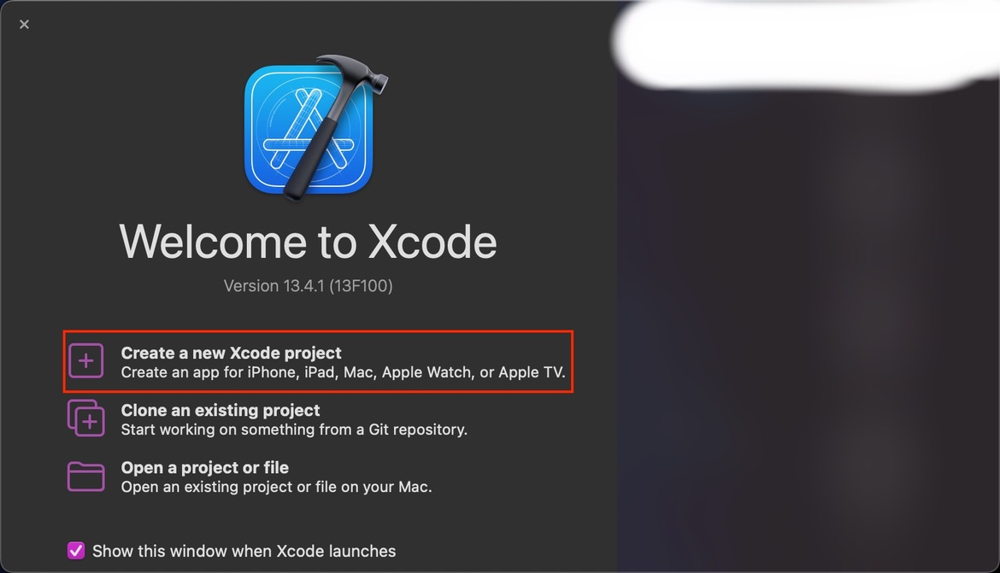
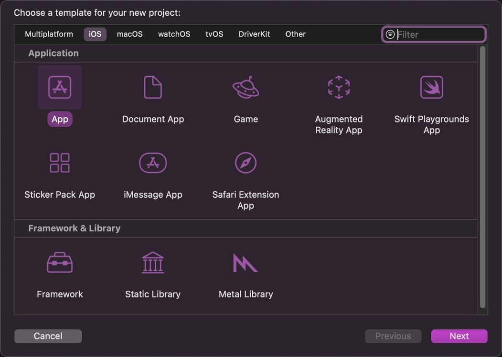
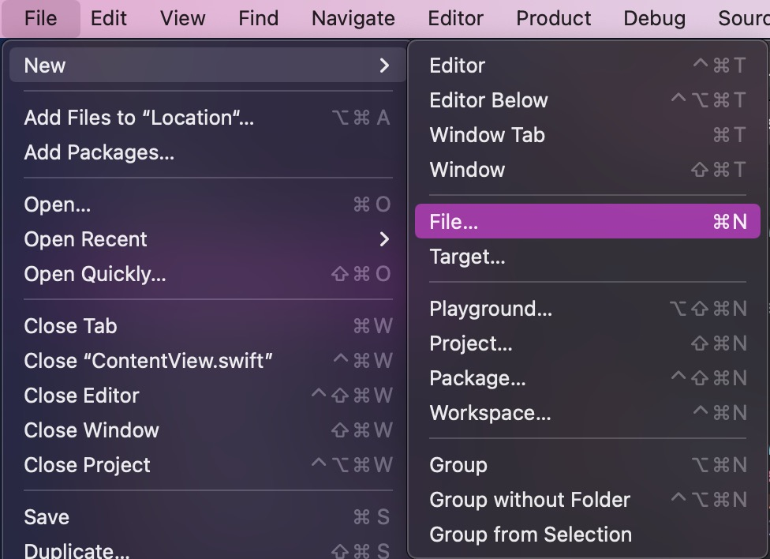
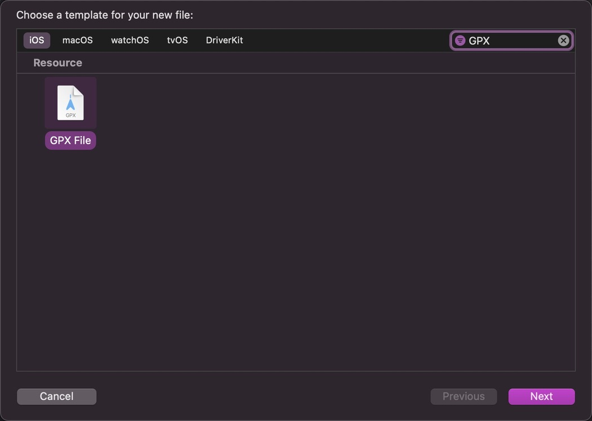
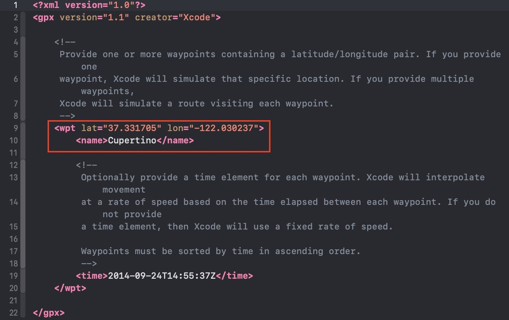
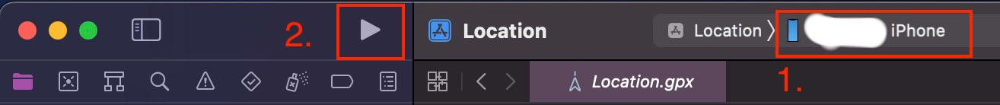
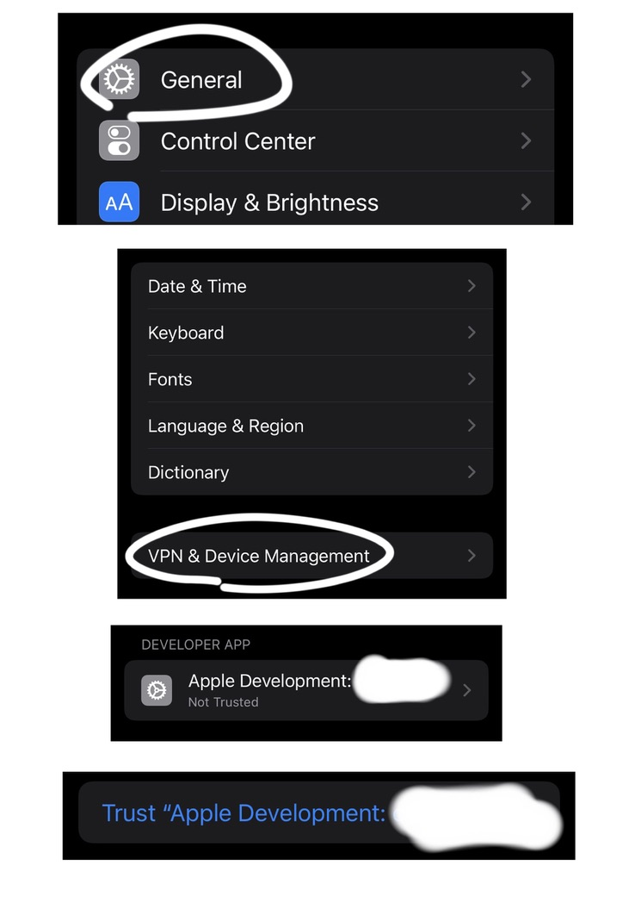

# Change GPS location on iPhone with Mac XCode

## Requirements

- iPhone
- Mac with XCode

## Steps

1. Connect iPhone to Mac with a cable. Open XCode on Mac and select "Create a new XCode project".

2. Choose iOS App.

3. Product Name doesn't matter. **But notice, if this is the first time you work on a XCode project, you need to create a personal team! (same email as Apple ID)** If you don't, then it won't work. No need to change other entries. Save to whatever folder you want.

4. Create a new GPX file.

5. Open the new created GPX file and change the latitude and longitude to the location you want. You can find the GPS location on Google Maps or other maps.

6. Unlock your phone, and at the top of the window, choose your iPhone, not other simulators. And then click run.

7. Wait for a couple of seconds, iPhone probably will prompt an alert of untrusted developer. Now you need to go to settings - general - VPN & Device Management, and then trust the developer.

8. Unlock the iPhone and click the run button again and wait for a couple of seconds and your iPhone will prompt a window with "Hello World". Now your iPhone location has changed to the location you set.

9. Close the app in the backeground and the current location will be back.